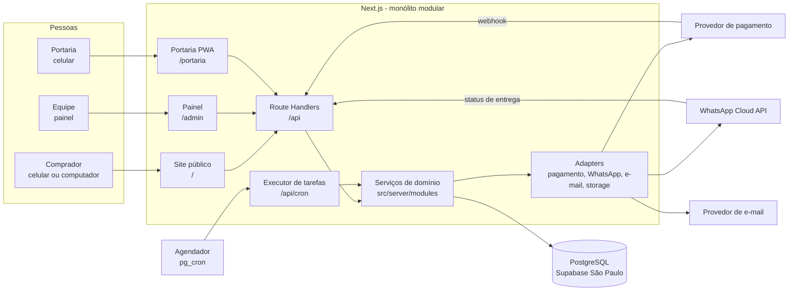
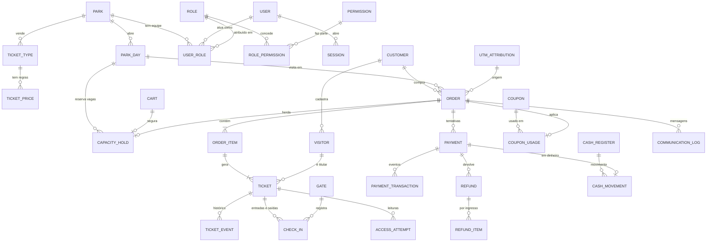
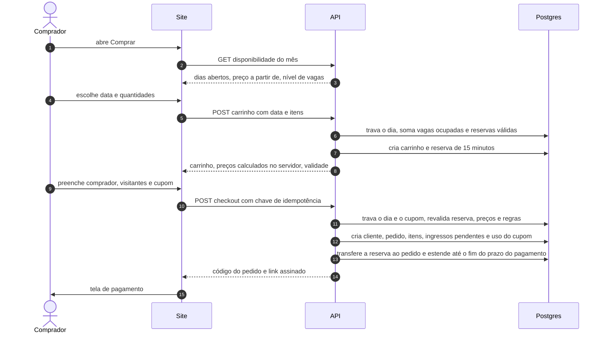
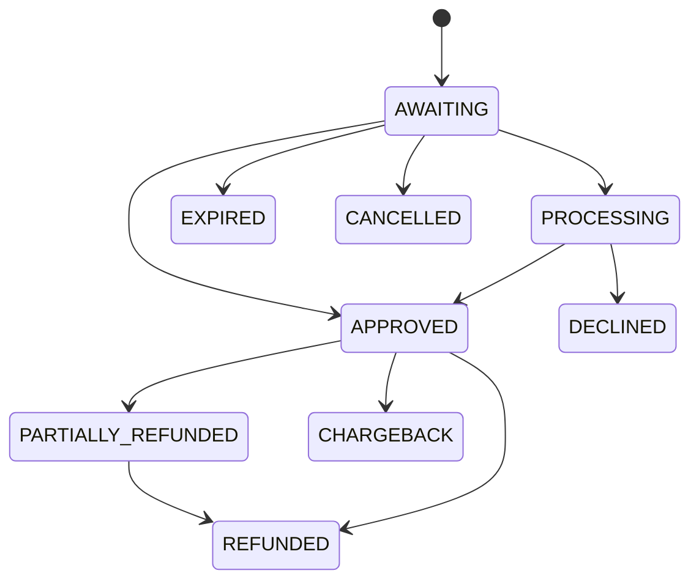
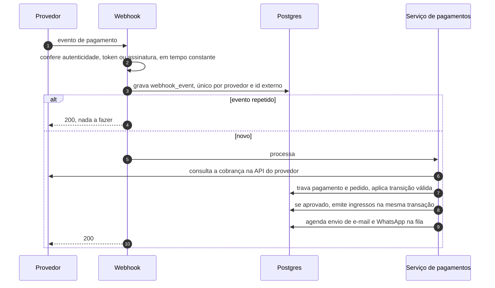
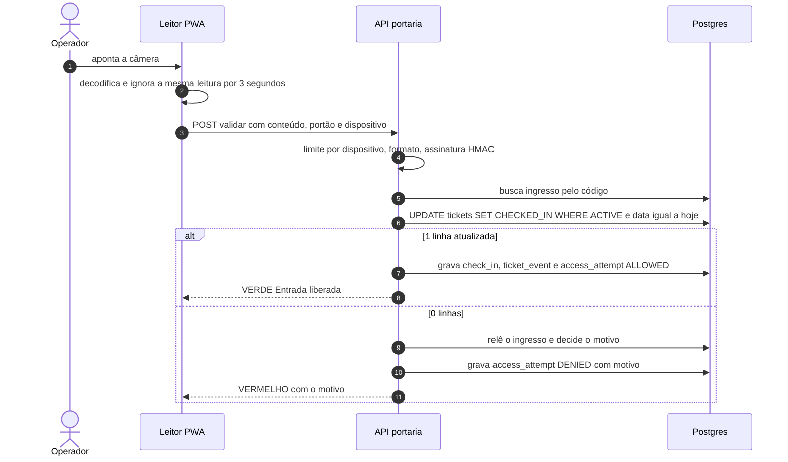

# Conquista Park — Arquitetura do sistema (V1)

> Documento vivo. Toda decisão estrutural nova entra aqui antes de virar código.
> Última revisão: 13/09/2026.

## Sumário

0. [Decisões em uma página](#0-decisões-em-uma-página)
1. [Arquitetura proposta](#1-arquitetura-proposta)
2. [Stack](#2-stack)
3. [Módulos](#3-módulos)
4. [Estrutura de pastas](#4-estrutura-de-pastas)
5. [Modelo principal do banco](#5-modelo-principal-do-banco)
6. [Entidades e relacionamentos](#6-entidades-e-relacionamentos)
7. [Fluxo de compra](#7-fluxo-de-compra)
8. [Fluxo de pagamento](#8-fluxo-de-pagamento)
9. [Fluxo de emissão](#9-fluxo-de-emissão)
10. [Fluxo de check-in](#10-fluxo-de-check-in)
11. [Estratégia de QR Code](#11-estratégia-de-qr-code)
12. [Estratégia de segurança](#12-estratégia-de-segurança)
13. [Estratégia de permissões](#13-estratégia-de-permissões)
14. [Integrações externas](#14-integrações-externas)
15. [Plano de implementação](#15-plano-de-implementação)
16. [Requisitos que exigem cuidado](#16-requisitos-que-exigem-cuidado)
17. [O que depende do parque](#17-o-que-depende-do-parque)

---

## 0. Decisões em uma página

| Tema | Decisão | Por quê |
|---|---|---|
| Forma | Monólito modular em Next.js: um repositório, um deploy, três áreas (site, painel, portaria) | Equipe pequena mantém; módulos isolados permitem extrair serviços no futuro |
| Banco | PostgreSQL gerenciado (Supabase, São Paulo) em **projeto novo e separado** | Baixa latência na Bahia; o projeto antigo guarda dados vivos de outro sistema |
| ORM | Prisma 7 com migrations versionadas; nunca `db push` nem `migrate dev` em produção | Tipagem ponta a ponta e SQL revisável |
| Dinheiro | Inteiro em centavos (`R$ 49,90` → `4990`) | Sem erro de ponto flutuante |
| Datas | Data da visita em `date` (sem fuso); instantes em `timestamptz`; "hoje" sempre calculado em `America/Bahia` | Evita o erro do site antigo, em que o dia sumia do calendário depois das 21h |
| Lotação | Trava da linha do dia (`SELECT … FOR UPDATE`) + reservas temporárias com validade | Zero overbooking com compradores simultâneos |
| Pagamento | Adapter por provedor; aprovação **só** por webhook autenticado seguido de consulta à API do provedor | O navegador nunca confirma pagamento |
| Ingresso | Um por visitante; QR = código público + assinatura HMAC; nenhum dado pessoal | Impossível adivinhar ou falsificar |
| Check-in | `UPDATE … WHERE status = 'ACTIVE' AND visit_date = hoje` atômico; toda leitura registrada | Dois leitores com o mesmo QR no mesmo instante: só um libera |
| Sem internet | **Nenhuma liberação offline na V1**; contingência operacional documentada | Liberação offline permite a mesma entrada duas vezes |
| Equipe | Sessão própria no banco (argon2id, cookie httpOnly) + permissões por parque verificadas no servidor | Revogação imediata e controle total |
| Comprador | Compra sem senha; acesso posterior por código enviado ao e-mail ou WhatsApp | Conversão no celular e menos contas para proteger |
| CPF | Guardado como HMAC (para busca) + versão mascarada (para exibição); o número completo não fica no banco | Um vazamento do banco não expõe CPFs |
| Tarefas | Fila persistente no Postgres + agendador a cada minuto | Mensagens e conciliação sobrevivem a falhas e reinícios |
| Tempo real | Polling curto (portaria, pagamento, painel) | Simples e suficiente; sem WebSocket |

---

## 1. Arquitetura proposta



### Camadas

1. **Interface** (`src/app`) — páginas (Server Components por padrão; Client Components só onde há
   interação) e Route Handlers finos. Um handler faz apenas: autenticar → autorizar → validar a entrada
   com Zod → chamar o serviço → formatar a resposta.
2. **Domínio** (`src/server/modules/*`) — as regras de negócio. Nenhuma regra mora em componente React
   ou em handler.
3. **Dados** (Prisma + PostgreSQL) — operações críticas sempre em transação; o banco é a última linha de
   defesa com `UNIQUE`, `FOREIGN KEY`, `CHECK` e triggers.
4. **Integrações** (`src/server/integrations/*`) — interfaces com implementação real e mock, escolhidas
   por variável de ambiente.

### Princípios

- O servidor recalcula tudo que envolve dinheiro, lotação e status. O navegador envia só intenção:
  data, tipo, quantidade, dados dos visitantes, cupom.
- Toda operação crítica é idempotente: chave de idempotência + unicidade no banco.
- Registro financeiro nunca é apagado. Cancelamento e reembolso são novos estados e novos registros.
- Todo dado de negócio tem `park_id`. A V1 opera um parque; o modelo já aceita várias unidades.
- Nada de funcionalidade de fachada: tela que aparece, funciona.

---

## 2. Stack

| Camada | Escolha | Versão | Observação |
|---|---|---|---|
| Framework | Next.js (App Router, Turbopack) | 16.3.5 | Route Handlers + Server Components |
| UI | React | 19.2 | versão validada pelo template oficial do Next 16.3 |
| Linguagem | TypeScript `strict` | 5.9 | o TypeScript 7 (compilador em Go) ainda não é suportado pelo `typescript-eslint` |
| Estilo | Tailwind CSS | 4.3 | tokens da marca em `@theme` |
| Banco | PostgreSQL 17 (Supabase `sa-east-1`) | — | usado como Postgres puro, sem depender de recurso exclusivo |
| ORM | Prisma ORM + `@prisma/adapter-pg` | 7.10 | a 8.0 ainda é release candidate |
| Validação | Zod | 4.6 | mesma validação no servidor e nos formulários |
| Senhas | `@node-rs/argon2` (argon2id) | 2.2 | parâmetros mínimos da OWASP |
| Logs | pino (JSON estruturado) | 10.3 | com `request_id` e redação de dados sensíveis |
| Componentes acessíveis | Radix Primitives | 1.6 | diálogo, menu, popover |
| Ícones / avisos | lucide-react · sonner | 1.45 · 2.0 | |
| QR (gerar) | qrcode | 1.5 | fase 5 |
| QR (ler) | `BarcodeDetector` nativo + polyfill `barcode-detector` (zxing-wasm) | 3.2 | fase 6 |
| Gráficos | Recharts | 3.10 | fase 7 |
| Planilha / PDF | exceljs · @react-pdf/renderer | 4.4 · 4.9 | fases 5 e 7 |
| Testes | Vitest (unidade + integração em Postgres real) · Playwright (e2e) | 5.0 · 1.63 | |
| Postgres para testes | embedded-postgres (binário oficial do Postgres 17 via npm) | 17.10 | a máquina de desenvolvimento não tem Docker |
| Pagamento | Asaas (PIX; cartão na página segura do Asaas) + Mock | — | outros provedores entram pelo mesmo adapter |
| E-mail | Resend (API HTTP) + Mock | — | |
| WhatsApp | WhatsApp Cloud API (Meta, oficial) + Mock | — | |
| Hospedagem | Vercel Pro (região `gru1`) **ou** container Node (EasyPanel) | — | `output: 'standalone'`, nenhuma API exclusiva de fornecedor |
| Agendador | Supabase `pg_cron` + `pg_net` chamando `/api/cron/*` com segredo | — | portável para qualquer cron HTTP |
| CI | GitHub Actions: lint, tipos, testes, build | — | o build pesado não roda na máquina local |

Ficam de fora de propósito: Redis (limites e fila cabem no Postgres neste volume), filas externas,
WebSocket, frameworks de autenticação de terceiros e bibliotecas de estado global.

---

## 3. Módulos

| Módulo | Responsabilidade | Fase |
|---|---|---|
| `auth` | Login da equipe, sessões, recuperação e troca de senha, limite de tentativas | 1 |
| `access` | Papéis, permissões, vínculo usuário ↔ parque, verificação no servidor | 1 |
| `users` | Cadastro e ciclo de vida da equipe | 1 |
| `audit` | Trilha imutável de ações | 1 (base) · 10 (cobertura total) |
| `parks` · `settings` | Dados da empresa e do parque; configurações tipadas | 1–2 |
| `calendar` | Dias de funcionamento, horários, lotação, feriados, eventos, bloqueios | 2 |
| `catalog` | Tipos de ingresso e regras de preço | 2 |
| `pricing` | Cálculo do preço por data — função pura, coberta por testes | 2 |
| `capacity` | Disponibilidade, reservas temporárias, trava de concorrência | 2–3 |
| `cart` · `checkout` | Carrinho com validade, dados do comprador e dos visitantes | 3 |
| `customers` | Comprador, visitantes, acesso sem senha, CRM básico | 3 · 8 |
| `coupons` | Cupons, regras e registro de uso | 3–4 |
| `orders` | Pedido, numeração, linha do tempo | 4 |
| `payments` | Cobranças, webhooks, conciliação, estados | 4 |
| `jobs` | Fila persistente e tarefas agendadas | 4 (base) · 9 |
| `tickets` | Emissão, QR, histórico, reenvio, reemissão, PDF | 5 |
| `checkin` | Validação, tentativas, portões, dispositivos, saída e reentrada | 6 |
| `dashboard` · `reports` · `analytics` | KPIs, gráficos, funil, UTM, exportações | 7 |
| `refunds` · `cancellations` | Políticas, reembolso total, parcial e por ingresso | 8 |
| `courtesies` | Cortesias com funcionário autorizador | 8 |
| `pos` | Venda presencial (bilheteria) | 8 |
| `cash` | Caixa: abertura, movimentos, sangria, reforço, fechamento | 8 |
| `finance` | Visão financeira, conciliação, exportação | 8 |
| `communications` | WhatsApp e e-mail: modelos, envio, histórico de status | 9 |
| `notifications` | Avisos internos e alertas de lotação | 9 |
| `search` | Busca global no painel | 10 |

---

## 4. Estrutura de pastas

```text
sistemapark/
├── .github/workflows/ci.yml          lint, tipos, testes e build
├── docs/
│   ├── ARQUITETURA.md                este documento
│   ├── SEGURANCA.md                  checklist verificável (fase 10)
│   ├── OPERACAO-PORTARIA.md          contingência sem internet (fase 6)
│   └── BACKUP.md                     backup e restauração (fase 11)
├── prisma/
│   ├── schema.prisma
│   ├── migrations/                   SQL versionado e revisado
│   └── seed.ts                       só roda em banco local
├── prisma.config.ts
├── public/brand/                     logos oficiais
├── scripts/
│   ├── create-admin.ts               primeiro acesso seguro
│   ├── sync-permissions.ts           catálogo de permissões → banco
│   └── db-local.ts                   Postgres local (desenvolvimento e testes)
├── src/
│   ├── app/
│   │   ├── (site)/                   área pública
│   │   │   ├── page.tsx              home
│   │   │   ├── comprar/              calendário → ingressos → checkout
│   │   │   ├── pedido/[code]/        pagamento, confirmação e ingressos
│   │   │   ├── meus-ingressos/
│   │   │   ├── consultar-ingresso/
│   │   │   └── politica-de-cancelamento/  termos/  privacidade/  contato/
│   │   ├── (equipe)/                 entrar/  recuperar-senha/  redefinir-senha/  trocar-senha/
│   │   ├── admin/                    painel (o layout exige sessão)
│   │   │   ├── page.tsx              visão geral
│   │   │   ├── pedidos/  ingressos/  clientes/  calendario/  tipos-de-ingresso/  cupons/
│   │   │   ├── cortesias/  bilheteria/  caixa/  financeiro/  relatorios/  comunicacao/
│   │   │   └── usuarios/  permissoes/  auditoria/  configuracoes/
│   │   ├── portaria/                 PWA de check-in
│   │   └── api/
│   │       ├── auth/  admin/  public/  portaria/
│   │       ├── webhooks/[provider]/
│   │       ├── cron/[job]/
│   │       └── health/
│   ├── components/
│   │   ├── ui/                       design system
│   │   └── admin/  site/  portaria/
│   ├── server/                       só servidor (import 'server-only')
│   │   ├── env.ts  db.ts  logger.ts  errors.ts  http.ts  rate-limit.ts
│   │   ├── auth/                     senha, sessão, guardas
│   │   ├── access/                   catálogo de permissões e verificação
│   │   ├── audit/
│   │   ├── modules/                  um diretório por módulo de negócio
│   │   │   └── orders/               service.ts  schemas.ts  policies.ts  queries.ts
│   │   ├── integrations/
│   │   │   ├── payments/             types.ts  mock.ts  asaas.ts  index.ts
│   │   │   └── email/  whatsapp/  storage/
│   │   └── jobs/
│   ├── lib/                          código puro e compartilhado: dinheiro, datas, CPF, formatos
│   └── proxy.ts                      request id, verificação de origem, cabeçalhos
├── tests/
│   ├── unit/  integration/  e2e/
│   └── helpers/                      banco de teste com trava contra banco remoto
├── .env.example
└── README.md
```

---

## 5. Modelo principal do banco

### Convenções

- Tabelas e colunas em `snake_case`; modelos Prisma em `PascalCase`.
- Chave primária `uuid` v7 (ordenada no tempo, sem sequência visível).
- `park_id` em toda tabela de negócio; índices compostos começam por `park_id`.
- Dinheiro em `integer` (centavos). Percentual em pontos-base (`1000` = 10%).
- Data da visita em `date`; instantes em `timestamptz`.
- Estados como `enum` do Postgres; transições só pelo serviço do módulo.
- Tabelas de histórico são somente-inclusão: `audit_logs`, `ticket_events`, `access_attempts`,
  `cash_movements`, `payment_transactions`. `audit_logs` tem trigger que bloqueia `UPDATE`,
  `DELETE` e `TRUNCATE`.
- RLS ligado em todas as tabelas, sem políticas: a API REST automática do Supabase não enxerga nada.
  O sistema acessa o banco como dono das tabelas.

### Equipe e acesso

| Tabela | Campos principais |
|---|---|
| `users` | `name`, `email` (único, minúsculo), `phone`, `password_hash`, `status` (ACTIVE, SUSPENDED, DISABLED), `must_change_password`, `last_login_at`, `password_changed_at`, `created_by_id` |
| `roles` | `key` (único), `name`, `description`, `is_system` |
| `permissions` | `key` (único, ex.: `refunds.approve`), `module`, `description` |
| `role_permissions` | `role_id` + `permission_id` (chave composta) |
| `user_roles` | `user_id`, `park_id`, `role_id` (único no trio) |
| `sessions` | `user_id`, `park_id`, `token_hash` (único), `ip`, `user_agent`, `last_seen_at`, `expires_at`, `revoked_at` |
| `password_reset_tokens` | `user_id`, `token_hash` (único), `expires_at`, `used_at`, `requested_ip` |
| `rate_limits` | `key` (chave), `count`, `window_started_at` |

### Parque e configuração

| Tabela | Campos principais |
|---|---|
| `parks` | `slug` (único), `name`, `legal_name`, `cnpj`, `timezone` (padrão `America/Bahia`), `order_code_prefix`, contatos, endereço, `is_active` |
| `system_settings` | `park_id` + `key` (único), `value` (jsonb validado por schema Zod de cada chave), `updated_by_id` |
| `gates` | `park_id`, `name`, `kind` (MAIN, VIP, STAFF, EXIT), `is_active` |
| `devices` | `park_id`, `name`, `gate_id`, `token_hash`, `last_seen_at`, `registered_by_id`, `is_active` |

### Calendário, catálogo e preço

| Tabela | Campos principais |
|---|---|
| `park_days` | `park_id` + `date` (único), `status` (OPEN, CLOSED, BLOCKED), `opens_at`, `closes_at`, `capacity` (`CHECK >= 0`), `day_kind_override` (HOLIDAY, EVENT, SPECIAL), `label` (ex.: "Feriado — 2 de Julho"), `sales_enabled`, `notes` |
| `ticket_types` | `park_id`, `slug`, `name`, `description`, `category` (ADULT, CHILD, HALF, SENIOR, PROMO, VIP, COURTESY, GROUP, EXCURSION, FAMILY, SPECIAL), `base_price_cents`, `min_age`, `max_age`, `holder_data` (NONE, NAME, NAME_BIRTHDATE, NAME_CPF, NAME_CPF_BIRTHDATE), `requires_document`, `document_hint`, `occupies_capacity`, `people_per_ticket`, `daily_quota`, `min_per_order`, `max_per_order`, `max_per_customer_per_day`, `channels`, `available_from`, `available_until`, `rules_text`, `image_url`, `sort_order`, `is_active` |
| `ticket_prices` | `ticket_type_id`, `name`, `price_cents`, `compare_at_cents`, `day_kinds` (WEEKDAY, WEEKEND, HOLIDAY, EVENT, SPECIAL), `weekdays` (0–6), `visit_from`, `visit_until`, `sale_starts_at`, `sale_ends_at`, `lot_quantity`, `priority`, `is_active` |

**Como o preço é escolhido.** Para um tipo e uma data, o sistema filtra as regras ativas que batem com o
tipo do dia (dia útil, fim de semana, feriado, evento), dia da semana, período da visita, janela de venda e
lote ainda disponível; vence a de maior prioridade. Sem regra, vale o `base_price_cents`. Exemplo: Adulto
com regra "Dia útil" R$ 50,00, "Fim de semana" R$ 70,00 e "Feriado" R$ 80,00 (prioridade maior). O painel
mostra a prévia: *"13/09/2026 (domingo): R$ 70,00 — regra Fim de semana"*.

### Venda

| Tabela | Campos principais |
|---|---|
| `customers` | `park_id`, `name`, `email`, `phone`, `birth_date`, `cpf_hash` (único com `park_id`), `cpf_masked`, `marketing_opt_in`, `notes` |
| `visitors` | `park_id`, `customer_id`, `name`, `birth_date`, `cpf_hash`, `cpf_masked` |
| `utm_attributions` | `park_id`, `anonymous_id`, `source`, `medium`, `campaign`, `content`, `term`, `referrer`, `landing_path`, `click_ids` |
| `carts` | `park_id`, `park_day_id`, `visit_date`, `token_hash`, `status` (ACTIVE, CONVERTED, EXPIRED, ABANDONED), `expires_at`, `utm_attribution_id`, `ip` |
| `cart_items` | `cart_id`, `ticket_type_id`, `quantity` |
| `capacity_holds` | `park_id`, `park_day_id`, `cart_id`, `order_id`, `people`, `status` (ACTIVE, CONVERTED, RELEASED, EXPIRED), `expires_at` |
| `capacity_hold_items` | `hold_id`, `ticket_type_id`, `quantity` — para cotas diárias por tipo |
| `order_sequences` | `park_id` + `year` (chave), `last_value` |
| `orders` | `park_id`, `code` (único com `park_id`, ex.: `CP-2026-000128`, prefixo configurável), `customer_id`, `buyer_name`, `buyer_email`, `buyer_phone`, `buyer_cpf_masked`, `park_day_id`, `visit_date`, `status` (PENDING_PAYMENT, CONFIRMED, CANCELLED, EXPIRED), `financial_status` (UNPAID, PAID, PARTIALLY_REFUNDED, REFUNDED, NOT_APPLICABLE), `channel` (ONLINE, POS, COURTESY, ADMIN), `subtotal_cents`, `discount_cents`, `fee_cents`, `total_cents`, `coupon_id`, `sold_by_id`, `authorized_by_id`, `courtesy_reason`, `access_version`, `expires_at`, `confirmed_at`, `cancelled_at`, `cancelled_by_id`, `cancel_reason`, `created_ip`, `user_agent`, `notes`, `utm_attribution_id` |
| `order_items` | `order_id`, `ticket_type_id`, `ticket_price_id`, `ticket_type_name` (retrato do momento), `quantity`, `unit_price_cents`, `discount_cents`, `total_cents` |
| `tickets` | `park_id`, `order_id`, `order_item_id`, `ticket_type_id`, `customer_id`, `visitor_id`, `holder_name`, `holder_birth_date`, `holder_cpf_masked`, `visit_date`, `park_day_id`, `code` (único com `park_id`), `qr_version`, `status` (PENDING_PAYMENT, ACTIVE, CHECKED_IN, CANCELLED, REFUNDED, EXPIRED), `is_courtesy`, `price_cents`, `presence` (NONE, INSIDE, OUTSIDE), `activated_at`, `checked_in_at`, `checked_in_by_id`, `checked_in_gate_id`, `checked_in_device_id`, `cancelled_at` |
| `ticket_events` | `ticket_id`, `type` (CREATED, PAYMENT_PENDING, ACTIVATED, CHECKED_IN, CHECKED_OUT, REENTRY, CANCELLED, REFUNDED, EXPIRED, REISSUED, RESENT, HOLDER_CHANGED), `actor_user_id`, `data`, `created_at` |
| `coupons` | `park_id`, `code` (único com `park_id`), `description`, `discount_type` (PERCENT, FIXED), `percent_bps`, `amount_cents`, `max_discount_cents`, `min_order_cents`, `starts_at`, `ends_at`, `visit_from`, `visit_until`, `weekdays`, `max_uses`, `max_uses_per_customer`, `first_purchase_only`, `channels`, `is_active`, `created_by_id` |
| `coupon_ticket_types` | `coupon_id` + `ticket_type_id` |
| `coupon_usages` | `coupon_id`, `order_id` (único), `customer_id`, `cpf_hash`, `discount_cents`, `status` (RESERVED, CONFIRMED, RELEASED) |

Os dados de contato do comprador ficam **copiados no pedido** (`buyer_*`). O cadastro do cliente não é
sobrescrito por uma compra anônima: sem isso, alguém que digitasse o CPF de outra pessoa trocaria o e-mail
dela e passaria a receber os ingressos dela.

### Pagamento e financeiro

| Tabela | Campos principais |
|---|---|
| `payments` | `park_id`, `order_id`, `provider` (MOCK, ASAAS…), `method` (PIX, CREDIT_CARD, DEBIT_CARD, CASH, CARD_TERMINAL, COURTESY), `status` (AWAITING, PROCESSING, APPROVED, DECLINED, EXPIRED, CANCELLED, PARTIALLY_REFUNDED, REFUNDED, CHARGEBACK), `amount_cents`, `fee_cents`, `net_cents`, `refunded_cents`, `provider_payment_id` (único com `provider`), `pix_payload`, `checkout_url`, `expires_at`, `approved_at`, `failure_code`, `failure_message`, `idempotency_key` (único), `cash_register_id`, `created_by_id` |
| `payment_transactions` | `payment_id`, `kind` (CREATED, STATUS_CHANGED, WEBHOOK, RECONCILED, REFUND_REQUESTED, REFUNDED, ERROR), `from_status`, `to_status`, `amount_cents`, `provider_reference`, `data` (sanitizado), `created_at` |
| `provider_customers` | `provider` + `customer_id` (único), `provider_customer_id` |
| `refunds` | `park_id`, `order_id`, `payment_id`, `amount_cents`, `reason`, `status` (REQUESTED, PROCESSING, COMPLETED, FAILED, REJECTED), `provider_refund_id`, `idempotency_key` (único), `requested_by_id`, `approved_by_id`, `completed_at`, `failure_message` |
| `refund_items` | `refund_id`, `ticket_id`, `amount_cents` |
| `webhook_events` | `provider` + `external_id` (único), `event_type`, `authenticity` (VERIFIED, INVALID), `status` (RECEIVED, PROCESSED, IGNORED, FAILED), `payload` (sanitizado), `attempts`, `last_error`, `payment_id`, `received_at`, `processed_at` |
| `cash_registers` | `park_id`, `operator_id`, `terminal`, `status` (OPEN, CLOSED), `open_lock` (único; igual ao operador enquanto aberto, nulo depois), `opened_at`, `opening_cents`, `closed_at`, `closed_by_id`, `expected_cents`, `counted_cents`, `difference_cents`, `closing_notes` |
| `cash_movements` | `cash_register_id`, `type` (SALE, REFUND, INCOME, EXPENSE, WITHDRAWAL, REINFORCEMENT, CANCELLATION), `method`, `direction` (IN, OUT), `amount_cents` (`CHECK > 0`), `order_id`, `payment_id`, `description`, `created_by_id`, `created_at` |

### Portaria

| Tabela | Campos principais |
|---|---|
| `check_ins` | `park_id`, `ticket_id`, `gate_id`, `device_id`, `operator_id`, `kind` (CHECK_IN, CHECK_OUT, REENTRY), `method` (QR, MANUAL), `created_at` |
| `access_attempts` | `park_id`, `ticket_id`, `gate_id`, `device_id`, `operator_id`, `method`, `result` (ALLOWED, DENIED, REVIEW), `reason` (OK, ALREADY_USED, CANCELLED, REFUNDED, PAYMENT_PENDING, FUTURE_DATE, PAST_DATE, EXPIRED, NOT_FOUND, INVALID_FORMAT, INVALID_SIGNATURE, OTHER_PARK, DOCUMENT_REQUIRED, DOCUMENT_REJECTED, REENTRY_NOT_ALLOWED), `payload_fingerprint`, `ip`, `created_at` |

### Comunicação, operação e trilha

| Tabela | Campos principais |
|---|---|
| `communication_logs` | `park_id`, `channel` (WHATSAPP, EMAIL), `provider`, `template`, `recipient`, `customer_id`, `order_id`, `ticket_id`, `status` (QUEUED, SENT, DELIVERED, READ, FAILED), `provider_message_id`, `error`, `attempts`, `sent_at`, `delivered_at`, `read_at`, `failed_at` |
| `notifications` · `notification_reads` | alertas internos; `dedupe_key` único (ex.: `capacity:2026-12-25:90`) para não repetir aviso |
| `jobs` | `type`, `payload`, `status` (PENDING, RUNNING, DONE, FAILED), `run_at`, `attempts`, `max_attempts`, `locked_at`, `last_error`, `dedupe_key` (único) |
| `funnel_events` | `park_id`, `anonymous_id`, `step`, `path`, `cart_id`, `order_id`, `utm_attribution_id`, `created_at` |
| `customer_access_codes` · `customer_sessions` | código de 6 dígitos (hash, 10 minutos, 5 tentativas) e sessão do comprador |
| `audit_logs` | `park_id`, `actor_type` (USER, SYSTEM, WEBHOOK, CUSTOMER), `actor_user_id`, `action`, `entity_type`, `entity_id`, `before`, `after`, `ip`, `user_agent`, `request_id`, `data`, `created_at` |

### Correspondência com as entidades pedidas

| Pedido na especificação | No modelo |
|---|---|
| User, Role, Permission, RolePermission | `users`, `roles`, `permissions`, `role_permissions` (+ `user_roles` por parque) |
| Customer, Visitor | `customers`, `visitors` |
| Park, ParkDay | `parks`, `park_days` |
| Capacity | `park_days.capacity`, `ticket_types.daily_quota`, `capacity_holds`, `capacity_hold_items` |
| TicketType, TicketPrice | `ticket_types`, `ticket_prices` |
| Order, OrderItem, Ticket, TicketEvent | `orders`, `order_items`, `tickets`, `ticket_events` |
| Payment, PaymentTransaction, Refund | `payments`, `payment_transactions`, `refunds` (+ `refund_items`) |
| Coupon, CouponUsage | `coupons`, `coupon_usages` (+ `coupon_ticket_types`) |
| CheckIn, AccessAttempt, Gate | `check_ins`, `access_attempts`, `gates` (+ `devices`) |
| CashRegister, CashMovement | `cash_registers`, `cash_movements` |
| Notification, CommunicationLog | `notifications`, `communication_logs` |
| AuditLog, WebhookEvent, SystemSetting | `audit_logs`, `webhook_events`, `system_settings` |
| UTMAttribution | `utm_attributions` (+ `funnel_events`) |

As tabelas nascem por fase, cada uma com sua migration, junto do código que as usa.

---

## 6. Entidades e relacionamentos



### Regras que o banco garante

- Um dia por data em cada parque (`UNIQUE (park_id, date)`).
- Código de pedido e código de ingresso únicos por parque.
- Um uso de cupom por pedido (`UNIQUE (order_id)` em `coupon_usages`).
- Um evento de webhook processado uma vez (`UNIQUE (provider, external_id)`).
- Uma cobrança do provedor ligada a um único pagamento (`UNIQUE (provider, provider_payment_id)`).
- Um caixa aberto por operador (`UNIQUE (open_lock)`).
- Valores nunca negativos e `total = subtotal − desconto + taxa` (`CHECK`).
- Trilha de auditoria imutável (trigger).

### Regras que o serviço garante, sob trava

- Lotação do dia e cota por tipo (trava na linha de `park_days`).
- Limite de usos do cupom (trava na linha de `coupons`).
- No máximo um pagamento aprovado por pedido (trava na linha de `orders`).
- Transições de estado válidas (máquinas de estado das seções 8 a 10).

---

## 7. Fluxo de compra



**Regras**

1. A disponibilidade mostrada é informativa; a verdade é conferida sob trava no carrinho e de novo no
   checkout.
2. Vagas ocupadas = ingressos `ACTIVE` ou `CHECKED_IN` que ocupam vaga + reservas `ACTIVE` ainda dentro
   da validade. Reserva vencida deixa de contar sozinha; a tarefa agendada só faz a limpeza.
3. O preço vem sempre do servidor. Se o navegador mandar preço, ele é ignorado.
4. Limites: quantidade mínima e máxima por pedido e por tipo, compras por cliente por dia, reservas ativas
   por IP.
5. Criança de colo (ou qualquer tipo com `occupies_capacity = false`) não consome vaga.
6. Dados por visitante seguem o tipo do ingresso. Padrão: nome de cada visitante, CPF só do comprador,
   data de nascimento quando o tipo tem faixa etária — a idade é conferida na data da visita.
7. O checkout funciona com uma mão, no celular, em uma coluna, com resumo e contador fixos.
8. UTM e origem são capturadas na primeira página e ligadas ao carrinho e ao pedido.

---

## 8. Fluxo de pagamento

### Estados do pagamento



| Estado | Rótulo |
|---|---|
| AWAITING | Aguardando pagamento |
| PROCESSING | Processando |
| APPROVED | Aprovado |
| DECLINED | Recusado |
| EXPIRED | Expirado |
| CANCELLED | Cancelado |
| PARTIALLY_REFUNDED | Reembolsado parcialmente |
| REFUNDED | Reembolsado |
| CHARGEBACK | Contestado (cartão) |

### Criação da cobrança

1. O comprador escolhe PIX ou cartão. `POST /api/public/orders/{code}/payments` com chave de
   idempotência: repetir o clique devolve a mesma cobrança.
2. **PIX:** o adapter cria a cobrança no provedor e devolve o código copia-e-cola; a página mostra QR,
   botão copiar e contador; consulta o status a cada 3 segundos, com recuo progressivo.
3. **Cartão:** o comprador digita o cartão **na página ou no iframe seguro do provedor**. Número de
   cartão nunca passa pelo nosso servidor (evita a certificação PCI-DSS completa).
4. **Presencial (bilheteria):** dinheiro gera movimento no caixa aberto do operador; maquininha registra
   o NSU; PIX presencial usa a mesma cobrança do online. Cortesia não gera cobrança.

### Confirmação — só pelo servidor



- O conteúdo do webhook só serve para saber **qual** cobrança consultar. O estado vem da API do
  provedor.
- Transição já aplicada é ignorada (idempotência); transição inválida é registrada e gera alerta.
- Resposta rápida ao provedor; o trabalho pesado vai para a fila.
- **Conciliação:** a cada 10 minutos, pagamentos `AWAITING` ou `PROCESSING` com mais de 5 minutos são
  consultados no provedor. Cobre webhook perdido ou atrasado.
- **Expiração:** ao fim do prazo (PIX: 30 minutos, configurável) o pedido vira `EXPIRED`, a reserva é
  liberada, os ingressos pendentes expiram e a cobrança é cancelada no provedor.
- **Pagamento que chega depois de expirar:** o serviço trava o dia e confere a lotação. Havendo vaga, o
  pedido é confirmado normalmente. Não havendo, o pagamento é registrado, o reembolso integral é
  disparado automaticamente e comprador e financeiro são avisados.
- Pedido tem no máximo um pagamento aprovado. Um segundo pagamento aprovado para o mesmo pedido
  (ex.: PIX pago duas vezes) vira reembolso automático.

### Estados do pedido

| `status` | `financial_status` | Selo no painel |
|---|---|---|
| PENDING_PAYMENT | UNPAID | PENDENTE |
| CONFIRMED | PAID | PAGO |
| CONFIRMED (cortesia) | NOT_APPLICABLE | CORTESIA |
| CONFIRMED | PARTIALLY_REFUNDED | REEMBOLSADO PARCIAL |
| CANCELLED | REFUNDED | REEMBOLSADO |
| CANCELLED | UNPAID | CANCELADO |
| EXPIRED | UNPAID | EXPIRADO |

---

## 9. Fluxo de emissão

Na **mesma transação** que aprova o pagamento:

1. Pedido `PENDING_PAYMENT` → `CONFIRMED`, `financial_status = PAID`, `confirmed_at`.
2. Cada ingresso `PENDING_PAYMENT` → `ACTIVE`, `activated_at`, `qr_version = 1`.
3. Reserva de vagas → `CONVERTED` (a vaga passa a ser contada pelos ingressos ativos).
4. Uso do cupom → `CONFIRMED`.
5. `ticket_events` `ACTIVATED` para cada ingresso; `payment_transactions` e `audit_logs` do sistema.
6. Tarefas na fila: e-mail com ingressos, WhatsApp de confirmação, alerta de lotação se passou de um
   limite.

Depois do commit, a fila é acionada na hora (`after()` do Next) e o agendador cobre qualquer falha.

**Entrega.** A página do pedido mostra os ingressos assim que o pedido é confirmado. E-mail e WhatsApp
levam o link assinado do pedido. O QR é desenhado sob demanda (SVG na página, PNG no e-mail e no PDF) —
nada a guardar, nada a vazar. O comprador volta a qualquer momento por *Meus ingressos* (código de 6
dígitos enviado ao contato usado na compra).

**Reenvio** gera nova mensagem com o mesmo QR. **Reemissão** (ex.: o QR foi compartilhado num grupo)
incrementa `qr_version`: o QR antigo deixa de valer na hora e a tentativa de uso fica registrada como
"QR reemitido".

**Cortesia** usa o mesmo caminho, sem pagamento: exige funcionário autorizador, motivo e beneficiário;
ocupa vaga; entra nos relatórios separada da receita.

---

## 10. Fluxo de check-in



### O que a tela mostra

| Situação | Cor | Mensagem |
|---|---|---|
| Ativo, data de hoje | Verde | **ENTRADA LIBERADA** — nome, tipo, horário |
| Ativo, hoje, tipo exige documento (meia, idoso) | Amarelo | **CONFERIR DOCUMENTO** — Confirmar entrada / Recusar |
| Já utilizado | Vermelho | **INGRESSO JÁ UTILIZADO** — primeira entrada às 14:30, portão, operador |
| Pagamento pendente | Vermelho | Pagamento pendente |
| Cancelado | Vermelho | Ingresso cancelado |
| Reembolsado | Vermelho | Ingresso reembolsado |
| Data futura | Vermelho | Ingresso válido para 20/09/2026 |
| Data passada ou expirado | Vermelho | Ingresso de 06/09/2026 — não é válido hoje |
| Assinatura não confere | Vermelho | Ingresso inválido — QR alterado ou reemitido |
| Não encontrado ou ilegível | Vermelho | Ingresso inexistente |
| Outro parque | Vermelho | Ingresso de outra unidade |

- **Hoje** é calculado no servidor em `America/Bahia`. O relógio do celular não é usado.
- **Amarelo não consome o ingresso.** Só o toque em *Confirmar entrada* faz o check-in, com a mesma
  atualização atômica e registro de quem conferiu.
- **Leitor:** câmera traseira, alvo grande, vibração e som distintos para verde e vermelho, trava
  enquanto a requisição está em andamento, a mesma leitura é ignorada por 3 segundos, resultado fixo
  até a próxima leitura.
- **Busca manual** por CPF, nome, telefone, código do pedido ou do ingresso — resultados mascarados; o
  check-in manual exige permissão própria e fica registrado como `MANUAL`.
- **Saída e reentrada** (desligado por padrão): `CHECK_OUT` marca o visitante como fora; `REENTRY` só é
  aceito no mesmo dia se o último evento foi uma saída — também por atualização atômica.
- **Toda leitura** gera `access_attempts`, inclusive QR ilegível, com dispositivo, portão, operador e
  motivo. Muitas falhas seguidas no mesmo dispositivo geram alerta.

### Internet instável

- O PWA guarda só a casca do aplicativo, para abrir rápido mesmo com sinal ruim.
- Sem conexão, a tela avisa em vermelho: *"Sem internet — nenhuma entrada pode ser liberada pelo
  leitor"*; o leitor tenta de novo sozinho e volta ao normal ao reconectar.
- **A V1 não libera entrada offline.** Dois aparelhos offline não sabem o que o outro liberou: a mesma
  cópia de QR entraria duas vezes, e o erro só apareceria depois.
- Contingência operacional (`docs/OPERACAO-PORTARIA.md`, fase 6): internet 4G reserva na portaria;
  lista do dia em PDF gerada na abertura, com acesso restrito; em queda total, conferência pela lista e
  registro retroativo no sistema com motivo, auditado.
- Evolução possível (V2, com risco aceito por escrito): modo offline em **um único** aparelho por
  parque, com lista local assinada e sincronização posterior.

---

## 11. Estratégia de QR Code

**Conteúdo:** `CP1.<CÓDIGO>.<ASSINATURA>` — só letras maiúsculas, números e ponto, o que permite o modo
alfanumérico do QR (código menor, leitura mais rápida e tolerante).

| Parte | O que é |
|---|---|
| `CP1` | Formato e versão da chave de assinatura |
| `CÓDIGO` | 10 caracteres Crockford Base32 aleatórios (50 bits), único por parque; aparece impresso embaixo do QR para digitação manual |
| `ASSINATURA` | HMAC-SHA256(chave v1, `park_id` + código + `qr_version`), 26 caracteres (130 bits) |

- **Não é sequencial nem adivinhável**, e não carrega CPF, telefone, e-mail, valor ou link.
- **Não dá para falsificar** sem a chave secreta, mesmo com cópia do banco inteiro.
- **Não precisa ser guardado:** o servidor redesenha o QR quando quiser (página, PDF, reenvio).
- **Revogação** instantânea pelo status do ingresso; **reemissão** incrementa `qr_version`.
- **Rotação de chave:** a versão no prefixo diz qual chave verificar; a antiga continua aceita até os
  ingressos emitidos com ela vencerem.
- Comparação em tempo constante (`timingSafeEqual`).
- **Print ou cópia** de QR válido é idêntica ao original — por isso o uso único (quem entra primeiro
  leva, a cópia recebe "já utilizado" com data, hora, portão e operador) e o nome do titular na tela
  verde, para conferência quando houver dúvida.
- Renderização com correção de erro nível M, margem de 4 módulos, mínimo de 260 px na tela e brilho
  máximo sugerido na página do ingresso.

---

## 12. Estratégia de segurança

### Autenticação da equipe

- Senha com argon2id (19 MiB, 2 iterações — mínimo OWASP). Mínimo de 10 caracteres, bloqueio de senhas
  comuns e de senhas que contenham o e-mail; sem regras de composição (orientação NIST).
- Login com resposta e tempo iguais para e-mail inexistente e senha errada.
- Limites: 5 tentativas por e-mail + IP em 15 minutos; 30 falhas por IP em 15 minutos (logins certos não contam: a
  equipe do parque sai pelo mesmo IP); 50 falhas por conta em 1 hora
  (bloqueio temporário, registrado na auditoria). Nenhum bloqueio é permanente — ninguém consegue trancar o
  admin de propósito.
- Recuperação: token de 256 bits, guardado como hash, uso único, 30 minutos; resposta sempre genérica;
  redefinir a senha encerra todas as sessões.
- Primeiro administrador criado por comando no servidor (`npm run admin:create`), com senha forte gerada
  e troca obrigatória no primeiro acesso. Não existe usuário ou senha padrão.

### Sessões e cookies

- Token aleatório de 256 bits; no banco só o hash SHA-256.
- Cookie `__Host-cp_session`: `HttpOnly`, `Secure`, `SameSite=Lax`, `Path=/`.
- Validade absoluta de 12 horas e por inatividade de 2 horas; `last_seen_at` atualizado no máximo a cada
  5 minutos.
- Trocar senha, desativar usuário ou mudar papel revoga as sessões afetadas.

### CSRF, CORS e cabeçalhos

- Mutações da API exigem `Content-Type: application/json` e `Origin` igual ao do sistema (verificado no
  `proxy.ts`); webhooks e cron têm autenticação própria.
- Sem CORS aberto: a API só atende o próprio domínio.
- Cabeçalhos: `Strict-Transport-Security`, `X-Content-Type-Options`, `Referrer-Policy`,
  `Permissions-Policy` (câmera só em `/portaria`), `frame-ancestors 'none'` e Content Security Policy.

### Autorização

- Toda rota e todo Server Component do painel chamam `requirePermission` no servidor; esconder botão é
  só conveniência.
- Toda consulta filtra por `park_id` da sessão; ids vindos da URL são conferidos contra o parque.
- Detalhes na [seção 13](#13-estratégia-de-permissões).

### Dados de entrada e saída

- Zod em toda entrada (corpo, query, parâmetros, webhooks); campos desconhecidos rejeitados.
- Prisma parametriza as consultas; SQL manual só com template seguro (`$queryRaw` com parâmetros),
  nunca com concatenação.
- React escapa o conteúdo; `dangerouslySetInnerHTML` proibido com dado de usuário.
- Respostas trazem só os campos necessários; CPF sempre mascarado.

### Dinheiro, estados e concorrência

- Valores e estados calculados e alterados só no servidor, dentro de transação, com trava nas linhas
  disputadas (dia, cupom, pedido, pagamento).
- Idempotência em pagamento, webhook, emissão, check-in e reembolso.
- Nenhum registro financeiro é apagado.

### Webhooks

- Autenticidade conferida antes de qualquer coisa, em tempo constante.
- Estado buscado na API do provedor; o corpo do webhook não é confiável.
- Registro de todo evento recebido, inclusive os inválidos.

### Abuso

- Limite por IP e por dispositivo em login, carrinho, checkout, consulta de ingresso e portaria.
- Reserva temporária curta e quantidade de reservas ativas por IP limitada, para ninguém "esgotar" um dia.
- Cloudflare Turnstile pronto para ligar no checkout se houver ataque.

### Segredos

- Tudo em variáveis de ambiente, validadas na inicialização (o sistema não sobe sem elas).
- `.env*` fora do Git; `.env.example` sem valores reais.
- Chaves de QR e de CPF guardadas também fora do servidor (cofre de senhas do dono): sem elas não se
  validam QRs nem se busca por CPF.

### Erros e logs

- Formato único de erro, sem stack trace em produção:
  `{"error":{"code":"TICKET_ALREADY_USED","message":"Este ingresso já foi utilizado.","details":{}}}`
- Logs JSON com `request_id`; senha, token, cookie, CPF e cabeçalho `Authorization` são removidos
  automaticamente.

### LGPD

- Coleta mínima; dados por visitante configuráveis por tipo de ingresso.
- CPF: HMAC com chave secreta (busca exata) + máscara `***.456.789-**`; o número completo não é gravado.
- Marketing só com consentimento separado e desmarcado por padrão; mensagem transacional não é marketing.
- Pedido do titular: exportação dos dados e anonimização (nome e contatos substituídos, valores
  mantidos para o financeiro).
- Exportação de dados pessoais exige permissão própria e fica na auditoria.
- Prazos de guarda dos registros financeiros definidos com a contabilidade.

### Banco

- Projeto próprio, senha forte, conexão com SSL.
- RLS ligado em todas as tabelas (a API automática do Supabase fica sem acesso).
- Aplicação usa conexão com pool (`DATABASE_URL`); migrations usam conexão direta (`DIRECT_URL`).
- Testes só rodam contra Postgres local com banco `*_test` — trava no código, lição de um incidente
  anterior em outro projeto.
- Backups: plano Pro do Supabase (diário, 7 dias) + dump lógico diário criptografado fora do Supabase +
  teste de restauração mensal (`docs/BACKUP.md`).

---

## 13. Estratégia de permissões

- **Catálogo no código** (`src/lib/access.ts`) é a fonte da verdade, sincronizado com o
  banco a cada deploy.
- **Papéis** no banco com permissões padrão; a matriz é editável por quem tem `roles.manage`.
  `SUPER_ADMIN` sempre tem tudo e não é editável.
- **Atribuição por parque** (`user_roles`); a sessão carrega o parque atual. Na V1 a matriz de cada papel
  vale para todos os parques; quando houver mais de uma unidade, cada parque passa a ter a própria matriz.
- **Verificação** carregando as permissões efetivas do banco a cada requisição: mudança vale na hora.
- **Travas:** ninguém concede permissão que não tem; só `SUPER_ADMIN` atribui `SUPER_ADMIN`; o último
  `SUPER_ADMIN` ativo não pode ser removido nem desativado; limites de valor por configuração (desconto
  manual acima de X% e reembolso acima de R$ Y exigem aprovação).
- Toda mudança de papel e permissão vai para a auditoria com antes e depois.

### Catálogo

| Grupo | Permissões |
|---|---|
| Painel | `dashboard.view`, `dashboard.financial` |
| Calendário e ingressos | `calendar.view`, `calendar.manage`, `ticket_types.view`, `ticket_types.manage`, `prices.manage` |
| Vendas | `orders.view`, `orders.cancel`, `orders.export`, `tickets.view`, `tickets.resend`, `tickets.manage`, `customers.view`, `customers.manage`, `customers.export`, `coupons.view`, `coupons.manage`, `courtesies.create` |
| Financeiro | `payments.view`, `payments.reconcile`, `refunds.request`, `refunds.approve`, `finance.view`, `finance.export` |
| Bilheteria e caixa | `pos.sell`, `pos.discount`, `cash.operate`, `cash.view_all` |
| Portaria | `checkin.scan`, `checkin.manual`, `checkin.monitor`, `gates.manage` |
| Relatórios e marketing | `reports.view`, `reports.export`, `marketing.view` |
| Comunicação | `communications.view`, `communications.send` |
| Administração | `users.view`, `users.manage`, `roles.manage`, `settings.view`, `settings.manage`, `integrations.manage`, `audit.view` |

### Matriz padrão

| Permissão | Super admin | Admin | Gerente | Financeiro | Bilheteria | Portaria | Atendimento | Marketing | Leitura |
|---|---|---|---|---|---|---|---|---|---|
| `dashboard.view` | ✓ | ✓ | ✓ | ✓ | ✓ |  | ✓ | ✓ | ✓ |
| `dashboard.financial` | ✓ | ✓ | ✓ | ✓ |  |  |  |  |  |
| `calendar.view` | ✓ | ✓ | ✓ |  | ✓ |  | ✓ | ✓ | ✓ |
| `calendar.manage` | ✓ | ✓ | ✓ |  |  |  |  |  |  |
| `ticket_types.view` | ✓ | ✓ | ✓ |  | ✓ |  | ✓ | ✓ | ✓ |
| `ticket_types.manage` · `prices.manage` | ✓ | ✓ | ✓ |  |  |  |  |  |  |
| `orders.view` | ✓ | ✓ | ✓ | ✓ | ✓ |  | ✓ |  | ✓ |
| `orders.cancel` | ✓ | ✓ | ✓ |  |  |  |  |  |  |
| `orders.export` | ✓ | ✓ | ✓ | ✓ |  |  |  |  |  |
| `tickets.view` | ✓ | ✓ | ✓ | ✓ | ✓ |  | ✓ |  | ✓ |
| `tickets.resend` | ✓ | ✓ | ✓ |  | ✓ |  | ✓ |  |  |
| `tickets.manage` | ✓ | ✓ | ✓ |  |  |  | ✓ |  |  |
| `customers.view` | ✓ | ✓ | ✓ | ✓ | ✓ |  | ✓ | ✓ | ✓ |
| `customers.manage` | ✓ | ✓ | ✓ |  | ✓ |  | ✓ |  |  |
| `customers.export` | ✓ | ✓ |  |  |  |  |  |  |  |
| `coupons.view` | ✓ | ✓ | ✓ | ✓ |  |  |  | ✓ | ✓ |
| `coupons.manage` | ✓ | ✓ | ✓ |  |  |  |  | ✓ |  |
| `courtesies.create` | ✓ | ✓ | ✓ |  |  |  |  |  |  |
| `payments.view` | ✓ | ✓ | ✓ | ✓ |  |  |  |  | ✓ |
| `payments.reconcile` | ✓ | ✓ |  | ✓ |  |  |  |  |  |
| `refunds.request` | ✓ | ✓ | ✓ | ✓ |  |  | ✓ |  |  |
| `refunds.approve` | ✓ | ✓ |  | ✓ |  |  |  |  |  |
| `finance.view` | ✓ | ✓ | ✓ | ✓ |  |  |  |  | ✓ |
| `finance.export` | ✓ | ✓ |  | ✓ |  |  |  |  |  |
| `pos.sell` | ✓ | ✓ | ✓ |  | ✓ |  |  |  |  |
| `pos.discount` | ✓ | ✓ | ✓ |  |  |  |  |  |  |
| `cash.operate` | ✓ | ✓ | ✓ |  | ✓ |  |  |  |  |
| `cash.view_all` | ✓ | ✓ | ✓ | ✓ |  |  |  |  |  |
| `checkin.scan` · `checkin.manual` | ✓ | ✓ | ✓ |  |  | ✓ |  |  |  |
| `checkin.monitor` | ✓ | ✓ | ✓ |  |  |  |  |  | ✓ |
| `gates.manage` | ✓ | ✓ | ✓ |  |  |  |  |  |  |
| `reports.view` | ✓ | ✓ | ✓ | ✓ |  |  |  | ✓ | ✓ |
| `reports.export` | ✓ | ✓ | ✓ | ✓ |  |  |  |  |  |
| `marketing.view` | ✓ | ✓ | ✓ |  |  |  |  | ✓ | ✓ |
| `communications.view` | ✓ | ✓ | ✓ |  |  |  | ✓ | ✓ |  |
| `communications.send` | ✓ | ✓ | ✓ |  |  |  | ✓ |  |  |
| `users.view` | ✓ | ✓ | ✓ |  |  |  |  |  |  |
| `users.manage` · `roles.manage` | ✓ | ✓ |  |  |  |  |  |  |  |
| `settings.view` | ✓ | ✓ | ✓ |  |  |  |  |  |  |
| `settings.manage` · `integrations.manage` | ✓ | ✓ |  |  |  |  |  |  |  |
| `audit.view` | ✓ | ✓ | ✓ | ✓ |  |  |  |  |  |

### Rotas sensíveis

| Rota | Permissão mínima |
|---|---|
| `/api/admin/refunds` | `refunds.request` (criar) · `refunds.approve` (aprovar) |
| `/api/admin/users` | `users.view` (ler) · `users.manage` (alterar) |
| `/api/admin/roles` | `roles.manage` |
| `/api/admin/settings` | `settings.view` (ler) · `settings.manage` / `integrations.manage` (alterar) |
| `/api/admin/payments` | `payments.view` · `payments.reconcile` |
| `/api/admin/reports` | `reports.view` · `reports.export` |

---

## 14. Integrações externas

| Integração | Provedor V1 | Autenticidade | Mock | O que precisa do parque |
|---|---|---|---|---|
| Pagamentos | Asaas (PIX; cartão na página segura do Asaas) | token no cabeçalho `asaas-access-token` + consulta à API | aprovar, recusar, deixar pendente, expirar e reembolsar por botões no ambiente de desenvolvimento | chave sandbox agora; de produção antes de vender |
| E-mail | Resend | assinatura dos webhooks de entrega | registra em log e em memória nos testes | domínio com SPF e DKIM |
| WhatsApp | WhatsApp Cloud API (Meta) | assinatura `X-Hub-Signature-256` | registra em log | Meta Business verificado, número dedicado, modelos aprovados |
| Arquivos | Supabase Storage (API S3) | chave restrita ao bucket | pasta local | — |
| Agendador | Supabase `pg_cron` → `/api/cron/*` | `CRON_SECRET` | chamada manual | — |
| Analytics e anúncios | GA4, Meta Pixel, Google Ads, TikTok | — | eventos só no banco | ids das contas + aviso de cookies (LGPD) |
| Monitoramento | logs JSON; Sentry opcional | — | — | DSN, se quiser |
| Anti-robô | Cloudflare Turnstile (opcional) | verificação no servidor | desligado | chaves, se ativar |

### Interfaces

```ts
interface PaymentProvider {
  readonly id: 'mock' | 'asaas'
  createCharge(input: CreateChargeInput): Promise<ChargeResult>          // PIX: copia-e-cola; cartão: URL segura
  getCharge(providerPaymentId: string): Promise<ChargeSnapshot>          // fonte da verdade
  cancelCharge(providerPaymentId: string): Promise<void>
  refund(input: RefundInput): Promise<RefundResult>
  verifyWebhook(request: RawWebhookRequest): Promise<VerifiedWebhook>   // autenticidade + ids
}

interface EmailProvider {
  send(message: EmailMessage): Promise<{ providerMessageId: string }>
}

interface WhatsAppProvider {
  sendTemplate(message: WhatsAppTemplateMessage): Promise<{ providerMessageId: string }>
  verifyWebhook(request: RawWebhookRequest): Promise<WhatsAppStatusUpdate[]>
}

interface StorageProvider {
  put(key: string, body: Uint8Array, contentType: string): Promise<void>
  signedUrl(key: string, expiresInSeconds: number): Promise<string>
  delete(key: string): Promise<void>
}
```

### Mensagem de confirmação (WhatsApp)

Modelo a ser aprovado pela Meta, com as variáveis preenchidas pelo sistema:

```text
Olá, {{1}}! Sua compra no {{2}} foi confirmada.

Pedido: {{3}}
Data da visita: {{4}}
Quantidade de ingressos: {{5}}

Ver ingresso: {{6}}

Apresente o QR Code na entrada.
```

---

## 15. Plano de implementação

Cada fase termina com código no GitHub, migrations aplicadas, testes passando e o que ficou pronto
descrito no README.

| Fase | Entregas | Pronto quando |
|---|---|---|
| **1. Base técnica, autenticação, banco e design system** | Next.js + TypeScript strict, lint, CI · variáveis validadas, logger com `request_id`, formato de erro, `/api/health`, cabeçalhos, verificação de origem · Prisma + migration inicial (parque, equipe, papéis, permissões, sessões, recuperação, limites, configurações, auditoria imutável) · login, logout, recuperação e troca de senha, limites · criação segura do primeiro admin · RBAC com catálogo e matriz editável · telas de usuários, permissões e auditoria · design system · Postgres local para testes com trava | Equipe entra com senha forte; usuário sem permissão recebe 403 na API; mudança de usuário e de permissão aparece na auditoria; testes passam |
| **2. Datas, capacidades e tipos de ingresso** | Calendário (gerar dias por modelo semanal, editar dia, feriado, evento, bloqueio, lotação) · tipos de ingresso · regras de preço com prévia · cotas por tipo · configurações do parque | Para qualquer data o sistema responde aberto ou fechado, preço de cada tipo com a regra aplicada e vagas restantes |
| **3. Site, carrinho e checkout** | Home, comprar, calendário, seleção de ingressos, checkout, páginas institucionais · carrinho com reserva de 15 min · cupom · UTM e funil | 5 compradores simultâneos pelas 2 últimas vagas: só 2 reservas; preço alterado no navegador é ignorado |
| **4. Pedidos e pagamentos** | Numeração · adapter (Mock + Asaas sandbox) · PIX e cartão · webhook autenticado e idempotente · conciliação · expiração · pagamento tardio · fila de tarefas · pedidos no painel com linha do tempo | Webhook repetido não duplica nada; pedido não aprova sem confirmação do provedor |
| **5. Emissão e QR** | Ativação na confirmação · QR assinado · página do ingresso · PDF · e-mail · Meus ingressos com código · reenvio e reemissão | Compra aprovada mostra o QR em até 5 s; QR adulterado é recusado |
| **6. Portaria e check-in** | PWA · leitor com trava de repetição · telas verde, vermelha e amarela · busca manual · portões e dispositivos · saída e reentrada · histórico ao vivo · manual de contingência | Reuso, pendente, cancelado, outra data e dois leitores simultâneos bloqueados em teste automatizado e em celular real |
| **7. Dashboard e relatórios** | KPIs, gráficos, comparativos, mapa de horários, previsão, no-show, funil, UTM, ocupação · relatórios com filtros e exportação CSV, Excel e PDF | Números batem com consultas de conferência sobre os dados de seed |
| **8. Financeiro, PDV e caixa** | Bilheteria · caixa completo · cortesias · cancelamento por política · reembolso total, parcial e por ingresso · conciliação e exportação · CRM básico | Fechamento de caixa confere com as vendas; reembolso sem permissão bloqueado |
| **9. WhatsApp e e-mail** | Provedor oficial · modelos · lembrete na véspera · histórico com status · avisos internos · alertas de lotação 70, 80, 90, 95 e 100% | Toda mensagem tem registro e status; falha de envio não afeta a compra |
| **10. Auditoria, segurança e melhorias** | Auditoria em todas as ações da lista · busca global · revisão de permissões rota a rota · LGPD (exportação e anonimização) · CSP final | Checklist de `docs/SEGURANCA.md` verificado item a item |
| **11. Testes, otimização e produção** | E2E dos 8 cenários obrigatórios · carga no checkout e no check-in · revisão de índices · backup e restauração testados · domínio, deploy e monitoramento · manual de operação | Os 24 critérios de aceite da V1 passam |

### Cenários obrigatórios de teste

| Cenário | Tipo | Fase |
|---|---|---|
| Comprar → pagar → gerar QR → validar entrada | e2e | 6 |
| Tentar reutilizar QR | integração + e2e | 6 |
| Tentar usar ingresso pendente | integração | 6 |
| Tentar usar ingresso cancelado | integração | 6 |
| Ingresso de amanhã usado hoje | integração | 6 |
| Dois compradores pelo último ingresso ao mesmo tempo | integração com concorrência real | 3 |
| Webhook recebido duas vezes | integração | 4 |
| Reembolso sem permissão | integração | 8 |

---

## 16. Requisitos que exigem cuidado

| # | Requisito | Problema | Decisão |
|---|---|---|---|
| 1 | Check-in com internet instável | Liberação offline em dois aparelhos deixa a mesma cópia de QR entrar duas vezes | V1 só libera online; contingência operacional documentada; offline só em aparelho único numa V2, com risco aceito |
| 2 | PIX que cai depois da reserva vencer | A vaga pode ter ido para outra pessoa | Revalida a lotação: com vaga, confirma; sem vaga, reembolso automático e aviso |
| 3 | Pagamento com cartão | Cartão passando pelo servidor exige PCI-DSS completo | Cartão digitado só na página ou iframe do provedor |
| 4 | WhatsApp | API oficial exige Meta Business verificado e modelos aprovados (leva dias) e cobra por mensagem; APIs não oficiais arriscam banimento do número | API oficial; e-mail é o canal garantido; Mock até a aprovação — começar o cadastro na Meta já |
| 5 | Política de cancelamento configurável | Compra online tem direito de arrependimento de 7 dias (CDC, art. 49); uma regra configurada pode contrariar a lei | Padrão que respeita o art. 49; texto da política validado por advogado |
| 6 | Meia-entrada e idoso | Documento só pode ser conferido na portaria | Tipo "exige documento" abre a tela amarela; cota de meias por dia opcional |
| 7 | Reserva temporária de vagas | Robôs podem segurar vagas para "esgotar" um dia | Limite por IP e por pedido, reserva curta, Turnstile ligável |
| 8 | Hospedagem | Vercel Hobby não permite uso comercial e roda cron só uma vez por dia | Vercel Pro ou container (EasyPanel); agendador no Supabase |
| 9 | Backup | O plano Free do Supabase não oferece backup restaurável | Supabase Pro antes de vender + dump próprio diário criptografado |
| 10 | Numeração `CP-2026-000128` | Sequencial: revela volume de vendas e é adivinhável | Mantida para exibição; nunca serve de credencial |
| 11 | Dados de cada visitante | Pedir CPF de cada criança derruba a conversão no celular | Configurável por tipo; padrão enxuto (seção 7) |
| 12 | Tempo real | WebSocket aumenta custo e pontos de falha | Polling curto |
| 13 | Chaves de QR e de CPF | Perder a chave invalida todos os QRs e as buscas por CPF | Chaves versionadas, cópia no cofre do dono, procedimento de rotação |
| 14 | Dashboards com muitos dados | Agregar tudo a cada acesso fica lento com o volume | Índices próprios e cache curto; tabela de agregados diários se passar de 1 s |
| 15 | Máquina de desenvolvimento com 8 GB | Build e testes pesados travam o computador | CI no GitHub faz build e bateria completa |
| 16 | Banco de testes | Em outro projeto, testes apagaram o banco de produção | Testes só com host local e banco `*_test`, trava no código |
| 17 | Compra sem conta | O site antigo exigia conta para comprar | Compra sem senha; acesso posterior por código enviado ao contato da compra |
| 18 | Projeto Supabase existente | Guarda dados vivos de outro sistema | Projeto novo e separado |

---

## 17. O que depende do parque

| Item | Para quê | Quando |
|---|---|---|
| Criar o projeto Supabase `sistemapark` (região São Paulo) e informar a senha do banco | Aplicar as migrations e ligar o sistema | Agora |
| Deixar o repositório do GitHub privado | Código de sistema financeiro fora da vista pública | Agora |
| Permissão *Workflows: Read and write* no token do GitHub | Publicar o CI | Agora |
| Preços, lotação, horários e política de cancelamento reais | Configurar calendário e tipos | Fase 2 |
| Chave sandbox do Asaas | Integrar pagamentos | Fase 4 |
| Domínio e e-mail remetente | Links, e-mails e cookies seguros | Fase 5 |
| Cadastro na Meta (Business + WhatsApp) | Aprovação leva dias | Começar já; usar na fase 9 |
| Plano Pro do Supabase e hospedagem | Backup e uso comercial | Antes de vender (fase 11) |
